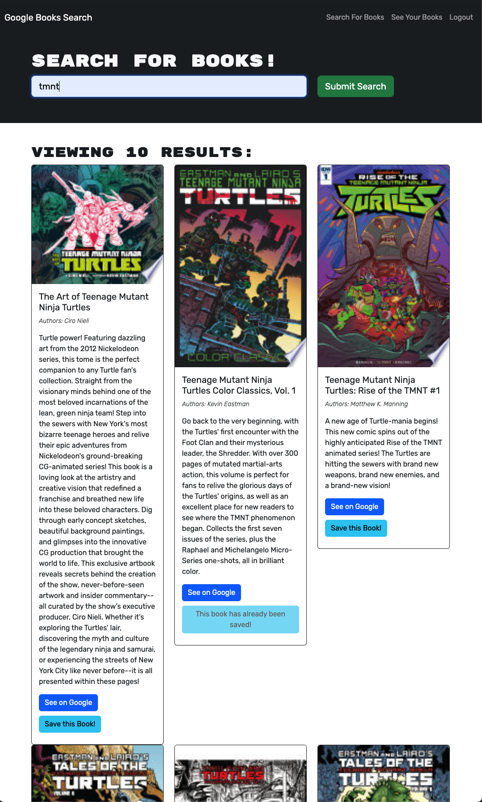

# UTA Coding Bootcamp Challenge  -- Book Search Engine

## Description

This is my submission for the Book Search Engine challenge in the UTA/EdX Coding Bootcamp. This challenge aimed to transform a RESTful API app to use Apollo Server and GraphQL.

<a href="https://main--noahmeister.netlify.app/">Link</a>

## Installation

N/A

## Usage

The navbar has links to a search page and a login/signup modal. When the user is logged in, there is a third option for a saved books page. On the search books page, there is an input field to query the Google Books Api, displaying a short list of matching entries with their titles, authors, descriptions, thumbnails, and links to their Google Books pages. When the user is signed in, there is also a button to save the book to the user's list. Once a book has been saved, the user can view it on the saved books page, where it is displayed with all of the corresponding data, in addition to a button that allows the user to remove the book from their list.

## Credits

The original RESTful app was provided by the UTA/EdX Bootcamp.

## License

This repo uses an MIT License. See above for details.
